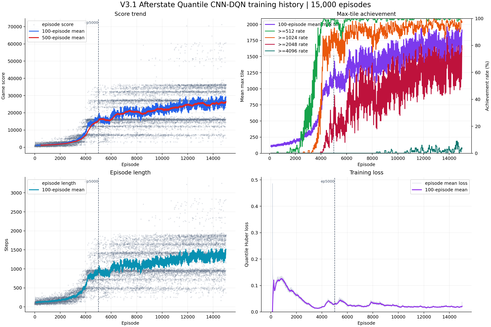
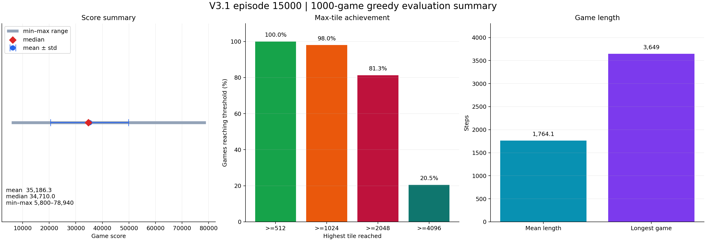

# 2048-CNN-DQN V3.1

基于 afterstate 的 CNN-DQN 过渡版本。训练侧使用 Double DQN、QR-DQN、PER、NoisyNet 和合法动作 ε-greedy；不再使用 V2 的 Transformer、SSL 和 Dueling Q head。

## 结果

`num-envs=64`，模型训练至 15,000 局，仍有持续上升趋势，不再继续训练了。第二张图片是 episode 15000 权重在固定 `seed=100000` 下进行的 1,000 局纯贪心测试结果。

| 指标 | 结果 |
| --- | ---: |
| 平均分 | 35,186.3 |
| 中位数分数 | 34,710 |
| 最高分 | 78,940 |
| `>=512` | 100.0% |
| `>=1024` | 98.0% |
| `>=2048` | 81.3% |
| `>=4096` | 20.5% |
| 平均游戏长度 | 1,764.1 步 |
| 最长游戏 | 3,649 步 |

## 参考

- [Optimistic Temporal Difference Learning for 2048（arXiv:2111.11090v1）](https://arxiv.org/abs/2111.11090v1)
- [2048: Reinforcement Learning in a Delayed Reward Environment（arXiv:2507.05465v1）](https://arxiv.org/abs/2507.05465v1)
